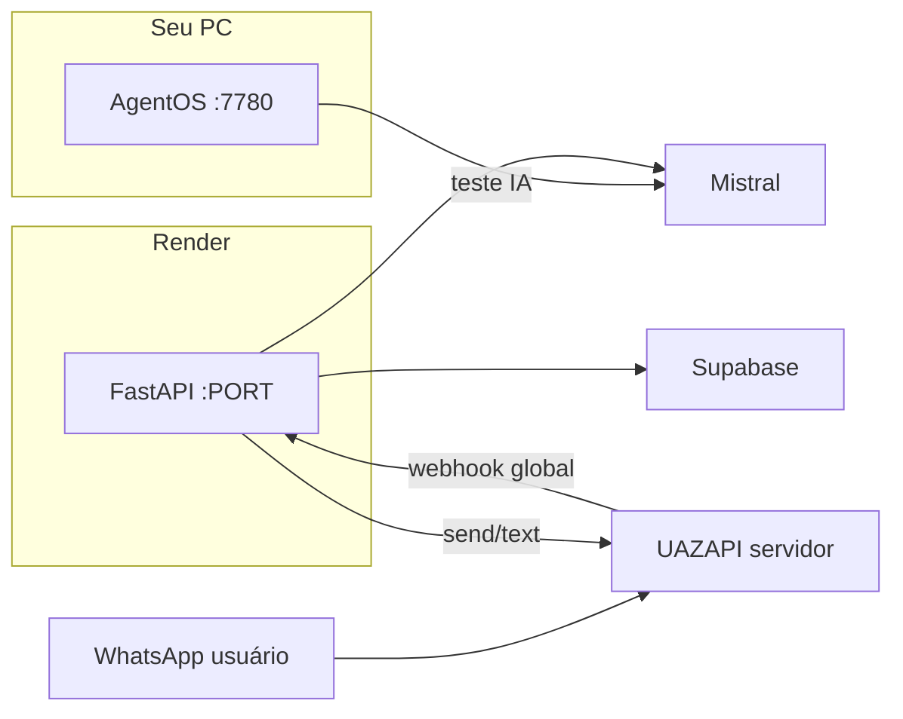

# 12 — Deploy no Render + webhook global

## O que sobe no Render

Só a **API FastAPI** (`api.main:app`) — recebe o webhook global da UAZAPI.

O **AgentOS** (`python run.py`) é **local** para testar o agente na UI; não precisa ir para o Render.

---

## Passo a passo — AgentOS (teste local)

### 1. Supabase pronto

No SQL Editor, em ordem:

1. `supabase/migrations/001_fase1_core.sql`
2. `002_enrollments.sql`
3. `003_attendance_qr.sql`
4. `004_gym_whatsapp_instances.sql`
5. `supabase/seed.sql`

### 2. `.env` em `backend/.env`

Mínimo:

- `MISTRAL_API_KEY`
- `SUPABASE_URL` + `SUPABASE_SERVICE_ROLE_KEY`
- `UAZAPI_ADMIN_TOKEN` (para onboarding WhatsApp)
- `DEFAULT_GYM_ID` = id da academia no seed

### 3. Subir AgentOS

```bash
cd backend
.venv\Scripts\activate
python run.py
```

Abrir no navegador:

| URL | Uso |
|-----|-----|
| http://127.0.0.1:7780 | UI do agente (os.agno.com Local) |
| http://127.0.0.1:7780/config | Configuração AgentOS |

Selecione o agente **FIT Recepcionista** e converse.

### 4. Frases de teste

**Onboarding WhatsApp (sem instância ainda):**

1. `A academia já tem whatsapp configurado?`
2. `Quero conectar o whatsapp da recepção`
3. `Qual o status da conexão whatsapp?`

**Atendimento (após seed + horários):**

4. `Quais planos vocês têm?`
5. `Quais horários de funcional amanhã?`

### 5. Teste rápido no terminal (sem UI)

```bash
python scripts/test_agent.py "Quais planos vocês têm?"
```

---

## Passo a passo — Render (produção)

### 1. Repositório no GitHub

Faça push do projeto `fit` para um repositório GitHub (Render conecta por lá).

### 2. Criar Web Service no Render

- **New → Web Service** → conectar o repo
- **Root Directory:** `backend`
- **Runtime:** Python 3.12
- **Build Command:** `pip install -r requirements.txt`
- **Start Command:** `uvicorn api.main:app --host 0.0.0.0 --port $PORT`

Ou use o Blueprint: arquivo `render.yaml` na raiz do repo.

### 3. Variáveis de ambiente (Render → Environment)

| Variável | Valor |
|----------|--------|
| `MISTRAL_API_KEY` | sua chave |
| `SUPABASE_URL` | URL do projeto |
| `SUPABASE_SERVICE_ROLE_KEY` | service role |
| `UAZAPI_BASE_URL` | `https://onnzetecnologia.uazapi.com` |
| `UAZAPI_ADMIN_TOKEN` | Admin Token do painel |
| `WEBHOOK_SECRET` | mesmo do `?wh=` (ex: valor longo aleatório) |
| `WEBHOOK_VALIDATE_QUERY` | `true` |
| `PUBLIC_API_URL` | URL do Render, ex: `https://fit-api.onrender.com` |
| `DEFAULT_GYM_ID` | `a0000000-0000-4000-8000-000000000001` |
| `UAZAPI_SEND_TEXT_PATH` | `/send/text` |
| `ENV` | `production` |

**Não** coloque token de instância WhatsApp no Render — só no Supabase após onboarding.

### 4. Deploy e health check

Após deploy:

```text
GET https://SEU-SERVICO.onrender.com/health
```

Deve retornar OK.

### 5. Webhook global UAZAPI

**Opção A — Painel UAZAPI (Webhook Global):**

```text
URL: https://SEU-SERVICO.onrender.com/webhook/uazapi?wh=SEU_WEBHOOK_SECRET
Eventos: messages, connection
Excluir: wasSentByApi, isGroupYes
```

**Opção B — Script (com `PUBLIC_API_URL` já no Render env):**

Localmente, apontando para produção:

```bash
cd backend
# .env com PUBLIC_API_URL=https://SEU-SERVICO.onrender.com
python scripts/setup_global_webhook.py
```

### 6. Conectar WhatsApp

1. AgentOS local: `iniciar_conexao_whatsapp` (ou painel UAZAPI manual)
2. Escanear QR no celular
3. Enviar mensagem para o número conectado → Render recebe webhook → agente responde

---

## Arquitetura resumida



---

## Troubleshooting

| Problema | Solução |
|----------|---------|
| AgentOS não abre | `python run.py` na pasta backend; URL `http://127.0.0.1:7780` |
| Tools falham | Rodar migrations + seed; conferir `SUPABASE_*` |
| Webhook 401 | `?wh=` igual a `WEBHOOK_SECRET` |
| `gym_not_found` | Rodar onboarding ou inserir em `gym_whatsapp_instances` |
| Render sleep (free) | Primeira mensagem pode demorar ~30s |
